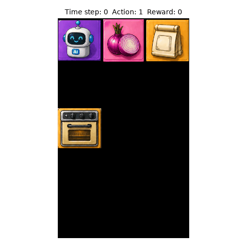
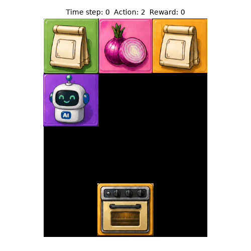

# ChronoCooked

## Description

ChronoCooked is a Gymnasium based benchmark environment for studying interval timing in reinforcement learning (RL) agents. 
Inspired by the Overcooked game, it uses cooking-themed scenarios that operationalize well-established psychology paradigms within an RL environment. 

For more details refer the Chronocooked paper: https://arxiv.org/abs/2608.16666 .

This repository contains the code for the RL environment tasks, evaluation metrics, baseline models, and experiments reported in the paper.


## Task Variants

ChronoCooked contains two core tasks: Fixed-Interval (FI) Timing and Temporal Bisection. Each has extensions that introduce additional timing requirements while retaining the basic structure of the core task.

### **Fixed-Interval (FI) Timing**: 
Basic soup delivery with a fixed interval.

 

  * Grid: 5 × 3
  * Oven states: `on`, `off`
  * Reward: +1 for successful soup delivery, 0 otherwise
  * RL Environment: `singleagent/rl_environments/time_production_basic.py`
  * **Multi-Timer** (extension): Multiple time production tasks with/without buffer (Compatible with Curriculum Learning)

    * Reward: Same as FI, except reduced for undercooked/overcooked soup
    * RL Environment: `singleagent/rl_environments/multitiming_production.py`

### **Temporal Bisection**: 
Soup delivery based on temporal categorization using two anchors and two delivery counters.



  * Grid: 4 × 3
  * Oven states: `on`, `off`, `ready`
  * Reward: +1 for successful timing and soup delivery, 0 otherwise
  * RL Environment: `singleagent/rl_environments/bisection_task.py`
  * **Multi-Anchor Categorization** (extension): Multiple anchor durations and delivery counters (Compatible with Curriculum Learning)

    * Reward: same as Temporal Bisection
    * RL Environment: `singleagent/rl_environments/bisection_multi_anchors.py`
  * **Asynchronous Multi-Oven** (extension): Multiple concurrent synchronous/asynchronous temporal bisection tasks (Compatible with Curriculum Learning)

    * Reward: 1/N per successful timing and soup delivery, where N is the number of temporal bisection tasks
    * RL Environment: `singleagent/rl_environments/bisection_multi_oven.py`


## Action Space
Across all tasks: Discrete (6)

- 0: wait
- 1: down
- 2: up
- 3: right
- 4: left
- 5: interact

Note:
No diagonal movements. 
Cannot move through objects and walls

## Observation Space
Type: Box(low=0, high=20, shape=(grid_shape), dtype=uint8)
(Across all tasks, except Multi-timer variant where high=30)

Observation channels encode:

- grid layout (channel 1)
- Agent position on the grid (channel 2)
- Agent state: Whether agent is carrying onion (channel 3) or soup (channel 4)
- Oven state: Whether "on", "off" and in some cases "ready" (channel 5)


## Episode Termination
Episode ends when:
- Soup is delivered  (Note: all soups for Asynchronous Multi-Oven), or
- Maximum timesteps reached (200)


## Starting State
Agent starts in a random free grid cell.

env.reset(seed=...) controls agent start position


## Repository Structure

| Directory | Contents                                                                           |
|---|------------------------------------------------------------------------------------|
| `singleagent/rl_environments/` | RL environment implementations for all Chronocooked tasks                          |
| `singleagent/train/` | Training scripts, including Curriculum Learning and baseline model implementations |
| `singleagent/eval/` | Jupyter notebooks for evaluation metrics and analysis                              |
| `singleagent/sb3_utils/` | Custom policies (CTRNN), model wrappers, and feature extractors (custom CNN)       |


## Installation

ChronoCooked experiments were conducted using **Python 3.10**.

The following package versions were used for the experiments reported in the paper:

* **PyTorch:** 2.14.0
* **Gymnasium:** 1.3.0
* **Stable-Baselines3:** 2.9.0
* **Stable-Baselines3 Contrib:** 2.9.0

Create a virtual environment and install the dependencies:

```bash
git clone <repository-url>
cd chronocooked
cd singleagent

python3 -m venv venv
source venv/bin/activate

pip install -r requirements.txt
```

ChronoCooked does not require a GPU and can be run on CPU-only systems. A compatible GPU can be used to accelerate training.

## Citation
You can cite Chronocooked using our related paper: https://arxiv.org/abs/2608.16666
